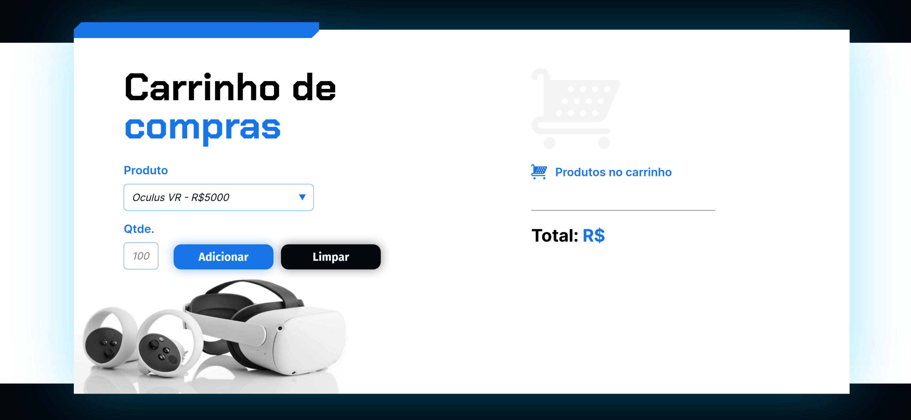

# Carrinho de Compras

Projeto desenvolvido durante o *Curso Lógica de programação: praticando com desafios*, dentro da formação **[A partir do zero: iniciante em programação](https://www.alura.com.br/formacao-programacao)** da [Alura](https://www.alura.com.br/).

## Objetivo

A partir do projeto incial, desenvolver a interatividade de um carrinho de compras:

* inserir produto;

* listar os produtos no carrinho;

* calcular o preço do produto de acordo com a quantidade;

* calcular o total do carrinho;

* limpar o carrinho.

[Codepen](https://codepen.io/edenpaulocruz/pen/eYoELvJ)